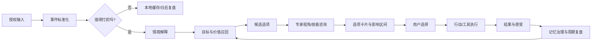
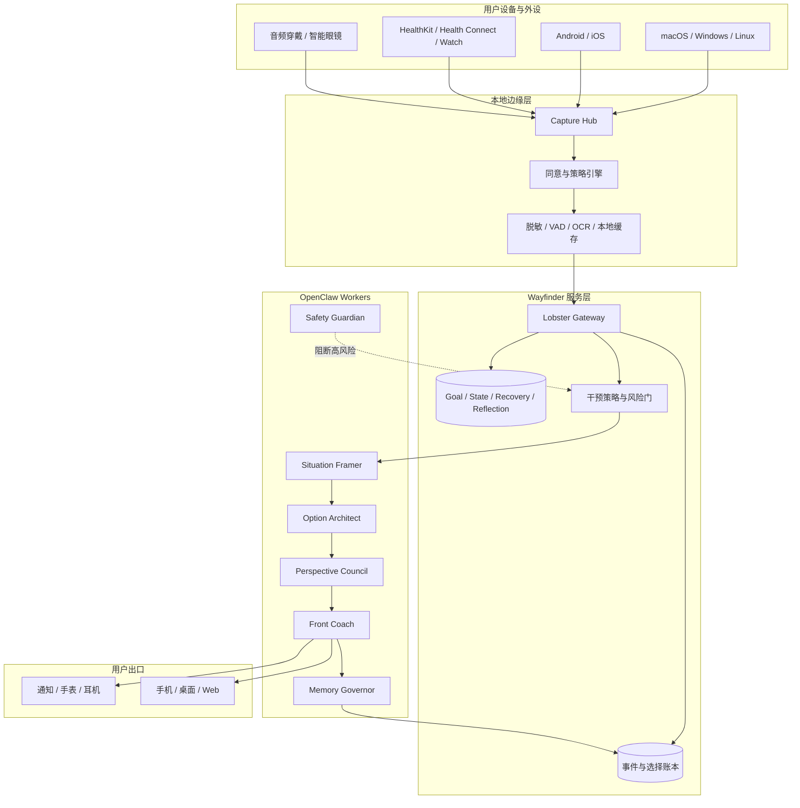

# MindAnchor Wayfinder：陪伴式人生决策支持系统开发方案

> 文档状态：前期讨论稿（2026-08-05）  
> 内部代号：`Northstar`  
> 建议产品名：`MindAnchor Wayfinder`  
> 关系：在现有 MindAnchor 底盘之上新增一个独立的陪伴/决策闭环，不替换现有 GoalFlow、State、Recovery、Reflection 和 Coach 主线。

## 1. 一页结论

### 1.1 要做的产品

Wayfinder 是一个**用户掌舵的长期个人陪伴系统**。它持续接收用户主动输入以及经过授权的环境信号，识别“此刻可能发生了什么”，再根据用户的目标、价值排序、边界、历史选择和当前状态，给出 3-5 个可执行选项。每个选项都必须说明：

- 现在可以做的第一步；
- 对当前目标的直接帮助；
- 可能的短期代价和长期影响；
- 影响判断的证据、置信度和不确定性；
- 是否可逆，以及如何撤销；
- 需要调用哪些技能或专家视角。

用户做最后选择。系统记录“情境 - 选项 - 选择 - 行动 - 结果 - 复盘”，逐步形成一个可检查、可修正的个人模型。它不是替用户做人生决定的自动驾驶，而是把生活中的模糊时刻变成可理解、可选择、可复盘的决策节点。

### 1.2 目前没有看到的完整成品

调研到 2026-08-05，没有发现一个同时具备以下闭环的成熟产品：

`多模态情境输入 -> 个人目标/价值模型 -> 多选项及后果解释 -> 用户确认 -> 行动记录 -> 周期复盘 -> 模型修正`

已有产品通常只覆盖一段：

- Rewind/Limitless/Recall/Screenpipe 主要解决“记住发生过什么”；
- Pi、Replika、Character.AI 主要解决“有人陪你聊”；
- Oura、WHOOP 主要解决“健康数据解释”；
- Motion、Reclaim、Sunsama 主要解决“任务和日程安排”；
- Letta、Mem0、Graphiti 主要解决“长期记忆和 agent 状态”；
- Omi 解决“开放式可穿戴采集和对话入口”。

Wayfinder 的空白和差异化在于：**将这些能力组织成用户可审计的选择系统，而不是继续增加一个更会聊天或更会采集的助手。**

### 1.3 推荐路线

先做**手机 + macOS/Windows 桌面 + 手动/按键语音输入**，不把智能眼镜作为首发前提；先验证“选项是否真正帮助用户做出更好的选择”，再增加持续音频、手表和眼镜。手机是统一权限和网络中枢，电脑是工作情境入口，手表提供低带宽的状态摘要，眼镜是可替换的高风险感知适配器。

### 1.4 与当前仓库的关系

当前仓库已经具备：

- Gateway/OpenClaw 的调用与 trace；
- Goal/Task/FocusSession/State/Recovery/Reflection；
- Coach 双阶段响应、可撤回记忆和反馈；
- Picard/Troi/Spock/Guinan/Jarvis/Data 的多专家权限模型；
- 桌面信号、Android 音频桥接、健康数据接口雏形；
- Web、macOS、Android 入口。

下一阶段真正新增的是：

- 事件级“任务/情境候选”识别；
- 价值模型驱动的选项生成与影响解释；
- 选择账本和行动结果模型；
- 外设统一适配层；
- 主动陪伴的剂量控制；
- 将结果反馈到长期个人模型的闭环。

不建议把现有系统推倒重写。建议在当前 monorepo 中以 `wayfinder` bounded context 逐步加入，长期再决定是否拆成独立部署。

---

## 2. 愿景、价值和产品边界

### 2.1 愿景

让一个人在人生中那些“事情发生了，但还没有决定怎么回应”的几秒到几小时里，拥有一个可靠的暂停点：

1. 系统帮他把情境说清楚；
2. 给出少量不同方向的选择；
3. 解释每个选择可能把他带向哪里；
4. 把选择权还给他；
5. 在稍后、当天和周期复盘中，让他看见自己正在形成什么样的模式。

产品价值不是让用户更依赖系统，而是让用户更能**解释自己的选择、承受选择的后果、并逐渐减少不必要的外部提示**。

### 2.2 首要用户和推广顺序

#### 阶段 A：只服务创建者自己

使用者已经愿意记录、复盘并容忍系统不完美。目标是验证：

- 任务识别是否比手动记录省力；
- 选项是否比单一建议更有帮助；
- 个人模型是否真的能改善下一次建议；
- 提醒是否让生活更稳定，而不是更嘈杂。

#### 阶段 B：5-20 人小范围试用

选择能够明确同意采集、愿意每周复盘、对个人数据边界有理解的成年人。此阶段不追求增长，重点是：

- 同意流程是否可理解；
- 误识别和误打扰是否可控；
- 不同人的价值模型是否会被模板污染；
- 人遇到高风险问题时系统是否能正确收敛到“暂停、求证、转介”。

#### 阶段 C：小规模商业化

先按“个人部署/家庭自托管/小团队自托管”设计，而不是先做大规模数据平台。只有完成隐私审计、儿童/脆弱人群排除、跨区域合规和真实效果评估，才考虑面向大众。

### 2.3 明确不是什么

Wayfinder 不应被设计成：

- 企业员工监控或生产力排名工具；
- 键盘记录器、聊天正文审查器、隐形录音器；
- 通过摄像头长期观察他人并自动分析的设备；
- 医疗诊断、精神疾病判断或危机干预替代品；
- 把用户锁在连续打卡、积分或通知里的游戏；
- 不经确认替用户发送消息、转账、改合同或执行高风险操作的机器人；
- “采集越多越聪明”的数据收集项目；
- 冒充真实哲学家、心理学家、政治家或科学家本人发表观点的角色扮演产品。

### 2.4 核心产品原则

1. **用户主权**：模型给选项，用户做决定；高风险行为必须显式确认。
2. **证据优先**：每个判断都显示来源、时间、置信度和缺失信息。
3. **最小必要采集**：能用事件摘要解决，就不保存原始音视频。
4. **先解释再建议**：先说“我认为发生了什么”，再说“你可以怎么做”。
5. **不确定性可见**：预测不是承诺，推测不是事实。
6. **可撤回**：记忆、偏好、选项反馈和自动计划都能查看、修改、撤回。
7. **低打扰**：陪伴的主动性由用户设置，系统必须有“安静时段”和干预预算。
8. **不以服从率为唯一目标**：接受建议不代表建议正确，拒绝建议也不是失败。
9. **数据可迁移**：用户可以导出结构化事件、记忆和选择历史。
10. **模型可替换**：不把个人命运绑定到单一模型供应商或单一硬件。

---

## 3. 调研结果：已有产品和开源项目

以下数据来自公开主页、GitHub API 和项目 README，星标为 2026-08-05 查询时的近似值，属于动态指标，不应作为产品质量的唯一证据。

### 3.1 商业产品对照

| 产品/方向 | 已验证能力 | 与 Wayfinder 的重合 | 主要空白或风险 | 建议借鉴 |
|---|---|---|---|---|
| [Limitless](https://www.limitless.ai/) / Rewind 方向 | Pendant/软件持续捕获、转录、检索个人历史 | 生活记忆、语音入口 | 官方页面显示 Limitless 已被 Meta 收购，停止向新用户销售 Pendant，并计划下线非 Pendant 功能；商业持续性和录音同意是硬风险 | 数据导出、删除和隐私说明；不要把硬件当核心护城河 |
| [Microsoft Recall](https://support.microsoft.com/windows/retrace-your-steps-with-recall) | Copilot+ PC 屏幕快照、时间线、语义检索、暂停和过滤 | 被动数字记忆 | 默认信任、误捕获、共享设备和权限争议 | 默认关闭、可见录制状态、逐应用排除、加密和一键删除 |
| [Google Project Astra](https://deepmind.google/technologies/gemini/project-astra/) | 实时摄像头/语音上下文对话 | 眼镜/手机即时感知 | 仍偏即时问答，不是长期目标和后果闭环 | 低延迟上下文压缩、实时交互体验 |
| [Meta Ray-Ban Meta](https://www.meta.com/smart-glasses/) | 可穿戴相机、麦克风、视觉问答、翻译、提醒 | 眼镜入口 | 依赖厂商能力，价值模型和可审计决策不足 | 设备权限、提示音和物理指示灯设计 |
| [Omi](https://github.com/BasedHardware/omi) | 开源可穿戴、桌面、手机；实时转录、摘要、行动项、记忆聊天 | 非常接近输入层和语音入口 | 以记录/检索/摘要为主，不含用户价值模型和选择账本 | MIT 代码、设备协议、桌面/手机/穿戴分层；先审查其云端默认和数据流 |
| [Bee](https://www.bee.computer/) / [PLAUD NotePin](https://www.plaud.ai/products/notepin) | 佩戴式录音、转写、摘要、待办抽取 | 直接验证“对话 -> 任务”需求 | 更接近 AI 录音笔，长期个人模型和决策结果闭环有限；产品状态和 API 需要持续核验 | 低摩擦佩戴、录音状态提示、会后行动项 |
| [Oura Advisor](https://ouraring.com/oura-advisor) / [WHOOP Coach](https://www.whoop.com/thelocker/whoop-coach/) | 睡眠、恢复、活动等健康数据的解释和建议 | 状态估计、低打扰干预 | 健康窄域，不处理生活目标冲突 | 指标趋势、置信度和渐进式建议 |
| [Pi](https://pi.ai/)、[Replika](https://replika.com/)、[Character.AI](https://character.ai/) | 连续对话、人格语气和情绪陪伴 | 陪伴和对话 | 缺少真实事件、证据链和行动结果；依赖可能过强 | 语气、主动对话边界和用户反馈 |
| [Rosebud](https://www.rosebud.app/) / [Mindsera](https://www.mindsera.com/) | AI 日记、主题洞察和周期复盘 | 反思和长期叙事 | 输入仍主要依赖用户主动记录 | 日记引导、模式总结和长期叙事 |
| [Motion](https://www.usemotion.com/) / [Reclaim](https://reclaim.ai/) / [Sunsama](https://www.sunsama.com/) | 日历、任务、动态重排 | GoalFlow 和计划恢复 | 没有多模态情境和人生价值模型 | 任务拆解、时间重排、可视化承诺 |

**结论**：市场验证了各个零件的需求，但没有验证“所有事情都应该被自动采集”。Wayfinder 应该把“决策质量和用户控制感”作为北极星，而不是把采集时长、对话时长或通知点击率当成北极星。

### 3.2 GitHub 开源项目和许可注意事项

| 项目 | GitHub 状态（约） | 许可 | 可复用部分 | 不应直接照搬 |
|---|---:|---|---|---|
| [danielmiessler/LifeOS](https://github.com/danielmiessler/LifeOS) | 17.1k stars | MIT | “Current State -> Ideal State”、目标/技能/个人上下文、可迁移配置 | 它更像 AI harness/个人工作系统，不是多模态生活采集器 |
| [BasedHardware/omi](https://github.com/BasedHardware/omi) | 13.1k stars | MIT | 设备协议、桌面/手机/穿戴架构、实时转录和应用技能 | 先审查云端依赖、同意模型、旁观者处理和数据保留 |
| [screenpipe/screenpipe](https://github.com/screenpipe/screenpipe) | 20.7k stars | 仓库标记为 `NOASSERTION`，需逐文件核查 | 本地屏幕/音频时间线、OCR/ASR、MCP/查询接口 | 不能把持续录制默认打开；其许可不应在未核验前嵌入闭源产品 |
| [openrecall/openrecall](https://github.com/openrecall/openrecall) | 2.9k stars | AGPL-3.0 | 本地 Recall 类索引、暂停/删除思路 | AGPL 义务、截图泄露风险、只解决回顾不解决选择 |
| [mem0ai/mem0](https://github.com/mem0ai/mem0) | 62.5k stars | Apache-2.0 | 用户/会话/agent 多层记忆、检索和评测 | 不能把自动抽取结果当事实；必须增加撤回、来源和保留策略 |
| [letta-ai/letta](https://github.com/letta-ai/letta) | 24.1k stars | Apache-2.0 | 有状态 agent、分层记忆、自我更新 | 记忆框架不等于产品安全策略；工具权限仍需自己收敛 |
| [existence-master/Sentient](https://github.com/existence-master/Sentient) | 686 stars | 仓库未声明标准 SPDX 许可 | 个人偏好、目标、任务、日程和多渠道助手的组合方式 | 许可不清时不可直接复制；通用执行权限需要沙箱 |
| [OtterMind/youclaw](https://github.com/OtterMind/youclaw) | 722 stars | MIT | Tauri/Bun、技能、调度、多渠道、持久记忆 | 它是通用桌面 agent，不含生涯决策与被动输入边界 |

### 3.3 研究依据

- [MyLifeBits](https://www.microsoft.com/en-us/research/project/mylifebits/)：证明“个人数字记忆”有价值，也说明全量记录会带来检索和隐私负担。
- [Generative Agents](https://arxiv.org/abs/2304.03442)：记忆流 -> 检索 -> 反思 -> 计划的循环，可借鉴，但论文中的虚拟人行为不能直接当作真实用户效果证据。
- [MemGPT](https://arxiv.org/abs/2310.08560)：分层内存和上下文换入换出，适合长期个人模型。
- [Ego4D](https://ego4d-data.org/) 与 [Project Aria](https://www.projectaria.com/)：第一视角多模态感知和事件记忆的研究参考，不代表商用时可以无条件录制旁观者。
- [JITAI 设计原则](https://doi.org/10.1007/s12160-016-9830-8)：及时、情境化、剂量可控的干预，比固定频率提醒更符合陪伴产品。
- [数字表型综述](https://doi.org/10.1038/s41746-018-0071-0)：被动手机/可穿戴数据可以用于研究行为模式，但相关性不等于因果关系，不能把推断包装成诊断。

---

## 4. 核心用户体验

### 4.1 关键循环



### 4.2 情境卡片

情境卡是所有主动介入的起点，至少包含：

- **我听到/看到的候选事件**：只显示已经脱敏的摘要，不展示无关原文；
- **我为什么认为它重要**：关联了哪个目标、任务或长期模式；
- **我的不确定性**：可能是任务、闲聊、承诺或误听；
- **需要确认的问题**：通常只问一个最小澄清问题；
- **处理状态**：草稿、待确认、已确认、已忽略、已归档。

示例：

> “刚才的对话中可能出现了一个‘周五前提交实验结果’的承诺。我不确定这是你本人要做的，还是别人说的。要不要把它作为一个待确认任务？”

系统不能把“可能听到了”直接写入任务真相，也不能在未确认时启动一串提醒。

### 4.3 选项卡片

选项数量默认 3 个，最多 5 个。每个选项使用同一结构，便于比较：

| 字段 | 含义 |
|---|---|
| 选项标题 | 一句话动作，避免抽象鸡汤 |
| 现在第一步 | 5-15 分钟内能执行的动作 |
| 目标帮助 | 对哪个目标、哪个约束有帮助 |
| 即时代价 | 时间、精力、关系或机会成本 |
| 可能的后果 | 短期/中期/长期，以区间和不确定性表达 |
| 反事实对照 | 如果不做，最可能发生什么 |
| 可逆性 | 可随时撤销、部分可逆或难以撤销 |
| 需要的视角 | 例如现实分析、情绪支持、谈判、科学证据 |
| 置信度 | 高/中/低，并链接证据 |
| 下一次检查点 | 何时复看结果 |

不得使用“这一定是最正确的选择”“你应该听我的”等措辞。低置信度时应减少断言，增加澄清或提供保守选项。

### 4.4 专家/哲学技能

“伟大的哲学家、心理学家、政治学家、科学家”应实现为**有来源的思想视角包**，而不是未经授权的数字分身。

建议首批技能：

- `values_clarification`：价值冲突和优先级澄清；
- `stoic_perspective`：控制范围、行动与不可控因素；
- `cbt_perspective`：事实、自动想法、证据、可测试的小行动；
- `systems_perspective`：反馈回路、二阶后果、杠杆点；
- `negotiation_perspective`：利益、边界、替代方案、沟通脚本；
- `scientific_reasoning`：假设、证据等级、反例和实验；
- `energy_recovery`：根据状态决定继续、降载或恢复；
- `relationship_care`：在不替用户代表对方的前提下准备沟通。

每个技能包必须包含：来源书目/论文、适用范围、禁用范围、典型问题、输出格式、风险等级、工具权限和版本号。若使用历史人物的思想，界面明确标注“基于公开作品的模拟视角”，不伪造引号和不存在的原话。对于仍在世的人物，不复制其个人风格，不声称得到其认可。

### 4.5 每日和周期陪伴

#### 每日开场

- 今天最重要的一个方向是什么？
- 当前可用精力如何？
- 哪个约束可能让计划失真？
- 是否要启用“轻提醒”“标准提醒”或“安静模式”？

#### 情境中

- 优先显示短响应，目标是约 5 秒内给出“发生了什么 + 下一步”；
- 用户主动展开后再生成完整解释，目标约 15-30 秒；
- 当前专注时段默认不打扰；
- 每日主动介入上限默认 3 次，用户可调低；
- 用户 dismiss 后，同类建议至少 6 小时内不重复。

#### 每日结束

- 今天做出了哪些选择？
- 哪个选择真的推进了目标？
- 哪个提示打扰了你？
- 精力、情绪、关系和产出的实际情况如何？
- 明天只保留哪一个主线？

#### 周/月复盘

复盘不是“完成率排行榜”，而是比较：目标方向、选择模式、后果、恢复行为、误判和用户主观感受。系统应主动区分：

- 用户选择了什么；
- 系统当时预测了什么；
- 实际发生了什么；
- 哪些结果不能归因于这个选择；
- 下次是否应该修改偏好或规则。

---

## 5. 长期个人模型

### 5.1 模型分层

不要把所有内容塞进一段“人格 prompt”。建议分为：

1. **稳定身份**：用户主动声明的基本事实、称呼、语言和重要边界。
2. **价值排序**：用户认可的长期方向，例如健康、创造、关系、财务安全、学术质量；每项带权重、有效期和冲突关系。
3. **目标图**：目标、里程碑、任务、依赖、证据和截止时间。
4. **工作方式**：偏好的时间块、提醒剂量、进入状态的条件、常见中断原因。
5. **状态基线**：睡眠、精力、注意力等个人基线；不能直接当作医学结论。
6. **选择历史**：在什么情境下选择了什么、结果怎样、用户是否认可。
7. **对话记忆**：可撤回的偏好、洞察和上下文，不写入任务/状态真相。
8. **预测校准**：系统过去在类似情境中的预测误差和用户反馈。

每条记忆都必须有来源、时间、置信度、作用域、保留期限和撤回状态。

### 5.2 写入和召回规则

- 默认只把用户明确确认的偏好写入长期层；模型推测进入候选区；
- 任务、健康和状态事实仍以业务数据库为真相，不以 agent memory 为真相；
- 召回按当前问题、目标和时间范围过滤，不把全部人生史注入模型；
- 自动提取的记忆在 10 分钟内提供 Undo；长期层支持 soft revoke 和永久删除；
- 撤回后立即停止召回，并在审计日志中保留“已撤回”而不是保留内容；
- 导出格式同时提供 JSON、Markdown 和人可读报告。

### 5.3 记忆质量门槛

一条内容只有在满足以下条件时，才允许影响高风险建议：

- 至少有两次独立证据，或一次用户明确确认；
- 仍在有效期内；
- 与当前情境的关联可以解释；
- 没有被用户撤回或标记为“仅供参考”；
- 不与更新后的用户声明冲突。

---

## 6. 多模态输入和设备策略

### 6.1 统一原则

设备不是产品本身，设备只提供带有同意和能力声明的事件。所有设备通过 `Device Adapter` 转成同一个事件协议：

```text
Device -> Local Capture Hub -> Consent/Redaction -> Event Envelope
       -> Mobile Gateway Relay -> API -> OpenClaw / Wayfinder Workers
```

手机优先作为跨设备的配对、权限、离线缓存、网络和通知中枢；桌面或眼镜断网时不得自行执行高风险动作。

### 6.2 分阶段输入能力

| 阶段 | 入口 | 输入 | 建议用途 | 主要限制 |
|---|---|---|---|---|
| P0 | 手机/Web | 手动文字、按钮、语音备忘录 | 验证选项和复盘价值 | 情境覆盖有限，但最安全 |
| P1 | macOS/Windows | active app、idle、锁屏、窗口类别、用户按键录音 | 工作任务、打断和恢复 | 不采集键入内容、截图或网页正文 |
| P2 | 手机音频 | 按住说话、短时授权录音、VAD、说话人分离摘要 | 对话中的任务候选 | 旁观者同意、语言和误听 |
| P3 | 手表/健康平台 | 睡眠、心率、活动、恢复摘要 | 调整提醒剂量和负荷 | 平台权限、设备偏差、不能诊断 |
| P4 | Omi/其他音频穿戴 | BLE 音频事件、设备状态、按键/唤醒 | 免手输入和短时捕获 | 电池、蓝牙、录音法律和厂商 SDK |
| P5 | 智能眼镜 | 相机/麦克风的明确触发片段、空间/设备状态 | 现场情境和即时询问 | 生态碎片化、旁观者隐私、带宽和续航 |

### 6.3 音频策略

首发不做“默认 24/7 云端上传”。推荐顺序：

1. 按键录音或明确唤醒词；
2. 本地 VAD，只上传用户说话片段的脱敏转写；
3. 只有在识别到候选任务后才请求用户确认；
4. 原始音频默认短滚动缓存，完成摘要后删除；
5. 需要保存时保存转写摘要和证据指纹，不默认保存双方数字音轨。

如果用户在公共场所或与他人交谈，必须有可见/可听的录制状态。产品需要提供旁观者提示和地区化合规策略；不能仅用“用户自己的设备”规避第三方同意问题。

平台约束必须写进产品定义，而不是在实现阶段再补：Android 的 `SpeechRecognizer` 官方说明不适合连续识别；常驻麦克风需要 foreground service、常驻通知和系统权限。iOS 不向普通第三方应用开放 Siri 级的后台常开唤醒能力，后台音频也必须符合声明用途和审核要求。因此“检测到任务”的首发实现应是按键/耳机手势/眼镜实体键触发，或前台本地 VAD 加 10-20 秒内存环形缓冲，不能承诺所有手机都能无感全天监听。

### 6.4 视频/眼镜策略

相机是最后加入的输入，因为它带来最大的隐私和误判风险。首个眼镜版本只支持：

- 用户主动按键或语音触发；
- 短片段、短时处理、默认不保存原始画面；
- 设备有物理指示灯或系统提示；
- 画面先在设备或手机上做区域遮挡、文字脱敏和人脸模糊；
- 结果只作为“情境线索”，不能直接生成对第三方的判断或标签。

不建议首发时承诺支持所有智能眼镜。先实现通用的 BLE/HTTP/SDK 适配接口，再为 Omi、Meta、Android XR 等具体设备写插件。

### 6.5 健康数据策略

Android 走 Health Connect，iOS 走 HealthKit。首批只使用：睡眠摘要、活动、静息心率/心率区间和用户主动填写的恢复感受。健康数据只用于：

- 调整建议的强度和提醒剂量；
- 解释“今天可能不适合原计划”的不确定线索；
- 周期复盘中比较个人基线。

不输出疾病判断、抑郁/焦虑诊断、医疗处方或“你必须停止工作”的强制结论。需要健康风险判断时，系统应建议专业评估。

HealthKit 和 Health Connect 是授权后的数据中心，不是始终实时的原始传感器总线：后台交付可能延迟，Apple Watch 高频指标通常需要 workout/live session，Wear OS 实时指标通常需要 Health Services。缺失数据必须标记为 `missing`，不能解释成“用户没有发生这件事”。设备事件统一保存 `sourceDevice`、`capturedAt`、`receivedAt`、`confidence`、`consentScope` 和 `retentionClass`，以便区分传感器延迟、断线和真正的行为变化。

实现时应以官方权限和商店政策为准：

- [Apple HealthKit](https://developer.apple.com/documentation/healthkit)、[HealthKit 隐私](https://developer.apple.com/documentation/healthkit/protecting_user_privacy)、[Speech](https://developer.apple.com/documentation/speech)、[BackgroundTasks](https://developer.apple.com/documentation/backgroundtasks)；
- [Android Health Connect](https://developer.android.com/health-and-fitness/health-connect)、[SpeechRecognizer](https://developer.android.com/reference/android/speech/SpeechRecognizer)、[麦克风 foreground service](https://developer.android.com/develop/background-work/services/fgs/service-types#microphone)；
- [Wear OS Health Services](https://developer.android.com/health-and-fitness/health-services) 和 [Data Layer](https://developer.android.com/training/wearables/data-layer)；
- [Apple App Review Guidelines](https://developer.apple.com/app-store/review/guidelines/) 与 [Google Play User Data policy](https://support.google.com/googleplay/android-developer/answer/10144311)。

---

## 7. 技术架构

### 7.1 推荐拓扑



### 7.2 责任边界

#### Client / Capture Hub

- 采集、权限提示、脱敏、离线缓冲和显示；
- 不保存业务真相；
- 不决定用户是否应该做某件高风险的事；
- 不把原始数据悄悄上传到第三方模型。

#### Gateway

- 鉴权、设备会话、同意证明、幂等和速率限制；
- 标准化事件、聚合已授权上下文；
- 调用策略引擎和 OpenClaw；
- 持久化事件、选项、选择、反馈、trace；
- 提供降级状态，但不在失败时伪造一个“模型已经判断过”的答案。

#### Policy Engine

这是新系统必须新增的非 LLM 层，负责：

- 当前是否允许打扰；
- 是否满足输入同意和数据最小化；
- 风险等级和是否需要二次确认；
- 每日干预预算、静默时段和重复抑制；
- 哪些工具可以被调用；
- 哪些类别必须转人工/专业资源。

LLM 不能绕过 Policy Engine。

#### OpenClaw Workers

- `situation-framer`：把事件整理成待确认情境；
- `option-architect`：基于目标、价值和约束生成候选选项；
- `perspective-council`：最多调用 1-3 个视角包，并返回证据和分歧；
- `front-coach`：把结果翻译成简洁对话和下一步；
- `memory-governor`：审查哪些信息可以写入长期模型；
- `safety-guardian`：识别自伤、医疗、法律、财务、未成年人和他人隐私风险；
- 现有 `state-insight`、`task-management`、`recovery`、`reflection`、`automation` 继续复用。

### 7.3 响应时序

| 响应 | 目标 | 内容 |
|---|---:|---|
| Edge acknowledgement | < 500 ms | 已收到、是否在录音、是否进入本地缓存 |
| Fast response | ~5 s | 情境摘要、置信度、一个澄清问题或最小下一步 |
| Full response | 15-30 s | 3 个选项、影响、证据、专家分歧、可执行路径 |
| Reflection | 异步 | 当天/周/月复盘、预测校准、记忆候选 |

已有 Coach 方案中的 fast/full、轮询、失败状态和 memory 撤回设计可以直接作为协议基础。首发不强制 SSE；同步返回 fast，再通过轮询或 WebSocket 获取 full。

---

## 8. 数据模型和接口建议

### 8.1 核心实体

建议新增 `wayfinder` 命名空间，不让 Agent memory 取代业务表。

```ts
type ContextEvent = {
  id: string;
  userId: string;
  sourceDeviceId: string;
  kind: 'voice_candidate' | 'manual_note' | 'desktop_signal' | 'health_summary' | 'wearable_signal';
  occurredAt: string;
  payload: Record<string, unknown>;
  confidence: number;
  consentRef: string;
  retentionClass: 'ephemeral' | 'summary' | 'long_term_candidate';
  evidenceRefs: string[];
};

type Situation = {
  id: string;
  eventIds: string[];
  status: 'draft' | 'awaiting_confirmation' | 'confirmed' | 'dismissed' | 'expired';
  summary: string;
  uncertainty: string[];
  linkedGoalIds: string[];
  linkedTaskIds: string[];
  riskLevel: 'low' | 'medium' | 'high' | 'critical';
  createdAt: string;
};

type DecisionOption = {
  id: string;
  situationId: string;
  action: string;
  firstStep: string;
  rationale: string;
  immediateBenefits: string[];
  costs: string[];
  projectedConsequences: Array<{ horizon: 'today' | 'week' | 'month' | 'long_term'; text: string; confidence: number }>;
  reversibility: 'reversible' | 'partly_reversible' | 'hard_to_reverse';
  valueAlignment: Array<{ valueId: string; effect: 'supports' | 'trades_off' | 'unknown'; explanation: string }>;
  evidenceRefs: string[];
  consultedSkills: string[];
  requiresApproval: boolean;
};

type DecisionRecord = {
  id: string;
  situationId: string;
  selectedOptionId?: string;
  userOverride?: string;
  selectedAt: string;
  actionStatus: 'not_started' | 'in_progress' | 'completed' | 'abandoned';
  outcome?: string;
  userFeeling?: string;
  userRating?: number;
  predictionError?: string;
  followUpAt?: string;
};
```

### 8.2 API 草案

```text
POST   /wayfinder/events
POST   /wayfinder/situations/:id/confirm
GET    /wayfinder/situations/:id
POST   /wayfinder/situations/:id/options
GET    /wayfinder/situations/:id/options
POST   /wayfinder/decisions
PATCH  /wayfinder/decisions/:id/outcome
POST   /wayfinder/decisions/:id/reflect
GET    /wayfinder/decisions?from=&to=&goalId=
GET    /wayfinder/patterns
GET    /wayfinder/consent
PATCH  /wayfinder/consent/:source
POST   /wayfinder/memories/:id/revoke
POST   /wayfinder/export
```

所有写接口要求 `idempotency-key`；事件和决定都要能重放；模型生成结果必须带 `traceId`、`modelTarget`、`skillVersions` 和 `evidenceRefs`。

### 8.3 首要数据库变更

建议新增 `supabase/migrations/003_wayfinder_decisions.sql`，包括：

- `wayfinder_context_events`；
- `wayfinder_situations`；
- `wayfinder_options`；
- `wayfinder_decisions`；
- `wayfinder_outcomes`；
- `wayfinder_value_profiles`；
- `wayfinder_consent_grants`；
- `wayfinder_intervention_budget`；
- `wayfinder_audit_events`。

原始音视频不直接进入这些表。原始媒体若因用户选择被保留，应进入单独加密存储，并记录保存期限、加密密钥版本和删除状态。

---

## 9. 与现有仓库的落地映射

### 9.1 可直接复用

| 现有资产 | Wayfinder 用法 |
|---|---|
| `apps/api` Gateway | 设备、会话、鉴权、read-model、trace 和新 `/wayfinder/*` 路由 |
| `packages/domain` | 新增 Wayfinder Zod schema，沿用现有 coach/memory/risk 类型 |
| `openclaw/runtime` | 新增 worker manifest、路由和权限声明 |
| `openclaw/skills` | 将现有 state/task/recovery/reflection 技能扩展为选项生成和结果回写 |
| `apps/macos` | 首个主动陪伴入口、桌面信号、Coach/选项卡片、通知和本地权限 |
| `apps/desktop` | 保留为跨平台 collector 备选；主线按现有状态决定是否继续 Electron |
| `apps/android-recorder` | 复用配对、音频 chunk、断线重放和局域网桥接 |
| `apps/web` | Wayfinder 选择账本、证据、趋势、记忆和设备同意管理 |
| Supabase schema | 新增事件、选择、结果和同意表；任务/状态事实仍使用旧表 |
| Agent team authority | Picard 路由、Jarvis 计划写入、Data 记忆治理，其他专家只给建议 |

### 9.2 建议新文件边界

第一阶段可以按以下边界添加，不急于重构现有大文件：

```text
packages/domain/src/wayfinder.ts
apps/api/src/services/wayfinder/event-service.ts
apps/api/src/services/wayfinder/situation-service.ts
apps/api/src/services/wayfinder/option-service.ts
apps/api/src/services/wayfinder/decision-service.ts
apps/api/src/services/wayfinder/intervention-policy.ts
apps/api/src/routes/wayfinder.ts
openclaw/skills/situation-framing-skill.schema.json
openclaw/skills/option-architecture-skill.schema.json
openclaw/skills/decision-outcome-skill.schema.json
openclaw/runtime/workers/wayfinder-*.mjs
apps/web/src/pages/WayfinderPage.tsx
apps/web/src/pages/DecisionLedgerPage.tsx
apps/macos/Sources/Wayfinder/
supabase/migrations/003_wayfinder_decisions.sql
```

新增服务只通过 Gateway 和 domain schema 访问业务数据，禁止 Agent 直接读写数据库。沿用现有 trace、stub、provider-direct、cluster-preferred 和回归矩阵。

### 9.3 需要修正的现有假设

- 现有文档把穿戴设备列为早期非目标；这应继续作为首发约束，而不是被新愿景绕过。
- 当前本地 OpenClaw 仍是最小兼容 runtime，不能把产品方案中的“多专家”误写成生产级自治集群已完成。
- Android/iOS 正式发行、健康数据正式发布和 Apple 签名仍是交付边界，需单独验收。
- “先进情绪识别”不能作为首个依赖。先使用用户自评、低风险行为信号和健康摘要，逐步验证增益。

---

## 10. 选项生成和决策安全

### 10.1 两阶段生成

#### 阶段一：结构化候选

由 `option-architect` 根据已确认情境生成 3-5 个不同策略，而不是让一个模型自由发挥一段建议。每个候选必须有：行动、成本、风险、可逆性、价值关联、证据和置信度。

#### 阶段二：专家咨询和合成

由 `perspective-council` 选择最多 3 个相关视角。专家只能提出分析或建议，不能写入计划、修改长期记忆或执行工具。`front-coach` 负责呈现分歧和共同点，而不是把不同意见平均成一句模糊的话。

### 10.2 风险分级

| 等级 | 示例 | 系统行为 |
|---|---|---|
| L0 | 选择先整理材料还是先休息 | 可给选项，可自动设置低风险提醒 |
| L1 | 调整个人任务顺序、准备一封草稿 | 需用户确认后写入计划或发送 |
| L2 | 辞职、公开发言、关系冲突、重大财务决定 | 只提供分析和问题清单，强制二次确认，不自动执行 |
| L3 | 自伤、他伤、医疗急症、违法规避、未成年人风险 | 停止普通建议，显示安全提示和专业/紧急资源，不模拟专家替代处理 |

### 10.3 工具调用边界

默认只允许：创建草稿、创建待确认任务、设置用户自己的提醒、查询已授权数据、启动反思会话。以下操作必须用户二次确认并显示完整内容：

- 发送消息或邮件；
- 修改日历中的他人共享事件；
- 付款、转账、购买或取消服务；
- 删除数据；
- 发布公开内容；
- 运行本地命令或改变系统权限。

### 10.4 失败和降级

- 没有同意：不处理该输入，并显示原因；
- 置信度太低：只问澄清问题，不生成确定结论；
- OpenClaw 不可用：显示“尚未完成分析”，不返回伪造的本地模型答案；
- full response 超时：保留 fast response，允许重试；
- 记忆写入失败：不阻断当前选择，但明确“本次没有写入长期记忆”；
- 外设断线：停止外设特有行为，沿用手机/桌面的安全默认值；
- 预测和结果冲突：记录校准误差，不悄悄覆盖旧预测。

---

## 11. 隐私、同意与安全设计

### 11.1 同意模型

同意不是一次性“接受隐私政策”，而是每个数据源、用途和保留期限的可见状态：

```text
source: microphone
purpose: detect user-confirmed task candidates
scope: when push-to-talk is active
rawRetention: 0 minutes after transcript accepted
derivedRetention: 30 days
modelSharing: local-only / selected provider
status: granted | paused | revoked
```

用户必须能逐项暂停：麦克风、相机、桌面活动、健康、位置、日历、第三方连接器、主动通知。

### 11.2 数据生命周期

1. 采集前：判断授权和是否在静默时段；
2. 采集中：本地 VAD、脱敏和短缓存；
3. 上传前：删除无关字段、生成 consentRef；
4. 推理后：只保存结构化摘要和证据指纹；
5. 过期后：自动删除原始媒体和临时转写；
6. 用户删除：撤回召回权、删除可删除副本、保留最小审计 tombstone；
7. 导出：可读、可迁移、包含模型版本和来源。

### 11.3 需要在试点前完成的合规审查

- 中国大陆：个人信息保护法、敏感个人信息、单独同意、跨境传输和录音/摄像法律；
- 欧盟/英国：GDPR、特殊类别数据、自动化决策解释权和删除权；
- 美国及其他地区：州级隐私法、健康数据法、录音的单方/双方同意规则；
- Apple/Google：HealthKit、Health Connect、麦克风、相机和后台运行权限及商店政策；
- 组织试点：不得把员工个人数据用于绩效考核，必须有单独的组织边界和退出机制。

此文档不是法律意见。公开试用前需要律师或合规顾问逐地区复核。

可作为合规起点的官方资料：

- [GDPR 正文](https://eur-lex.europa.eu/eli/reg/2016/679/oj)；
- [EU AI Act](https://eur-lex.europa.eu/eli/reg/2024/1689/oj)；
- [中国个人信息保护法（官方英文页面）](https://www.npc.gov.cn/englishnpc/c23934/202112/1abd8829788946ecab270e469b13c39c.shtml)；
- [FTC Health Breach Notification Rule](https://www.ftc.gov/business-guidance/resources/complying-ftcs-health-breach-notification-rule)；
- [FDA General Wellness Policy](https://www.fda.gov/regulatory-information/search-fda-guidance-documents/general-wellness-policy-low-risk-devices)。

---

## 12. 可行性评估

| 能力 | 技术成熟度 | 主要瓶颈 | 当前判断 |
|---|---|---|---|
| 手动输入和选项卡片 | 高 | 需要好的领域模型和交互 | 立即可做 |
| 语音转写 | 高 | 语言、噪声、端侧成本 | 首发使用按键/短片段 |
| 从语音提取任务候选 | 中高 | 误听、说话人、上下文缺失 | 必须先确认再写任务 |
| 桌面应用/窗口类别 | 高 | macOS/Windows 权限差异 | 复用现有信号边界 |
| 健康数据桥接 | 高 | 权限、平台审核、解释边界 | 作为状态摘要，不做诊断 |
| 情绪/压力推断 | 中低 | 个体差异、偏差、因果不足 | 只作低置信度线索，优先自评 |
| 选择后果预测 | 中低 | 缺少反事实数据和真实因果 | 输出区间/假设，记录预测误差 |
| 多专家分工和工具权限 | 中高 | 状态一致性、prompt 注入、审计 | 复用 OpenClaw authority model |
| 智能眼镜跨厂商 | 低到中 | SDK、续航、隐私、生态碎片化 | P4/P5 适配层，非首发前提 |
| 长期个性化模型 | 中 | 记忆污染、过拟合、撤回 | 先做结构化用户确认和校准 |

最重要的可行性不是“模型能不能回答”，而是：**在低延迟、低打扰、低误判和高隐私约束下，系统能不能稳定地只在值得介入的时刻帮助用户。**

---

## 13. 分阶段开发路线

时间是估算，不是承诺；每阶段必须以退出条件为准，不能以功能数量为准。

### P0：产品和测量基线（1-2 周）

范围：手动情境、选项卡片、选择账本、每日复盘。

交付：

- `ContextEvent/Situation/DecisionOption/DecisionRecord` schema；
- Web 端情境确认和 A/B/C 选项卡片；
- 选择、结果、用户评分和撤回；
- 10 个真实生活场景的离线评测集；
- 干预预算、静默时段和风险门；
- 数据删除/导出原型。

退出条件：连续使用 14 天，每个情境都能回放，用户能说明“为什么系统给出这三个选项”，且没有高风险自动动作。

### P1：个人桌面/手机 Alpha（4-6 周）

范围：macOS/Windows 轻量信号、手机手动语音备忘录、已有 Coach/GoalFlow/Recovery/Reflection。

交付：

- 桌面 active app/idle/锁屏事件适配；
- 手机按键录音、VAD、脱敏转写；
- 任务候选 -> 用户确认 -> Goal/Task 写入；
- fast/full 响应和 trace；
- 前台 Coach + 最多一次专家咨询；
- 每日不超过 3 次主动提示。

退出条件：个人真实使用 4 周；任务候选 precision、误打扰率、选择帮助度和隐私事件均有记录。

### P2：多模态状态 Alpha（6-8 周）

范围：HealthKit/Health Connect 摘要、Android 音频桥接、状态/能量低置信度融合。

交付：

- 设备能力和同意管理；
- 传感器时间对齐、缺失和断线处理；
- 状态结论显示证据和置信度；
- “继续/降载/休息”三类选项；
- 预测与实际结果的校准报表。

退出条件：系统可以在没有健康数据时正常工作；用户能够一键暂停某个数据源；没有把状态推断包装成医学结论。

### P3：5-20 人封闭试点（6-8 周）

范围：邀请制成年人，默认不启用相机和连续录音。

交付：

- 分层同意、数据导出和删除；
- 试点管理员只能看聚合健康指标，不能看个人内容；
- 反馈问卷、错误上报和安全事件流程；
- 每周人工复盘系统的误判和打扰；
- 退出、暂停和数据销毁流程。

退出条件：无未解决的高风险安全事件；用户能理解数据流；至少一半参与者认为选项比单一提醒更有帮助；不以日活/留存作为唯一成功标准。

### P4：可穿戴音频适配（6-10 周）

范围：先选择一种公开协议或 Omi 类设备，不承诺多品牌同时支持。

交付：

- BLE/设备 SDK adapter；
- 配对、断线、滚动缓存和物理录音指示；
- 设备级同意撤销；
- 电量、网络和延迟指标；
- 旁观者提示和公共场所策略。

退出条件：外设断线不丢失选择账本；默认关闭原始音频长期保存；在移动端权限变化后 30 秒内停止采集。

### P5：眼镜视觉入口实验（8-12 周）

范围：用户主动触发的短片段视觉问答和情境确认。

交付：

- 设备适配 API；
- 本地/手机端遮挡、模糊和片段删除；
- 物理指示和旁观者说明；
- 只输出环境线索，不输出第三方敏感属性；
- 电池/带宽/温度/延迟报告。

退出条件：任何地区和设备权限不明确时都能安全停用；否则不进入公开试点。

### P6：小范围推广和可迁移部署

范围：自托管、家庭部署、Provider 可替换、数据导出。

交付：

- 一键本地/家庭服务器部署；
- 供应商和模型可替换；
- 个人模型/技能包版本化；
- 脱敏后的匿名评测集；
- 发布前隐私和安全审计。

---

## 14. 评估指标和实验设计

### 14.1 模型质量

- 任务候选 precision/recall/F1；
- 情境摘要被用户确认的比例；
- 选项多样性：是否只是同一个建议换三种说法；
- 证据引用正确率；
- 置信度校准误差；
- 预测后果与实际结果的偏差；
- 高风险情境正确转介率。

### 14.2 用户价值

- 选择后 24 小时内的主观帮助度；
- 目标推进的可观察证据，而非单纯任务完成率；
- 中断后的恢复时间；
- 用户主动请求帮助的比例；
- 用户能够在没有系统提示时完成同类选择的比例；
- 用户对“我更有掌控感”的周期评分。

### 14.3 打扰和信任

- 每小时误打扰数；
- dismiss、mute、撤回和关闭权限的比例；
- 重复建议率；
- 用户能否解释数据为何被使用；
- 用户能否发现并撤回一条错误记忆；
- 安全事件和隐私投诉数量。

### 14.4 不能作为北极星的指标

- 连续使用天数；
- 消息点击率；
- 对模型建议的服从率；
- 采集小时数；
- 账户内存储的数据量；
- 用户在系统中停留的时长。

建议每次功能实验只改变一个变量，例如“显示置信度”或“把选项从 3 个增加到 4 个”，并通过用户选择、结果和复盘进行 A/B 或交叉实验。没有对照时，不把主观改善归因于模型。

---

## 15. 主要风险和应对

| 风险 | 具体表现 | 应对 |
|---|---|---|
| 过度监控 | 用户为了获得更好建议而默认开启所有传感器 | 最小采集、分项同意、默认关闭原始音视频、数据导出/删除 |
| 误听误判 | 把闲聊当任务、把别人的任务写给用户 | 候选状态、用户确认、说话人不确定时不写入 |
| 过度依赖 | 用户把模型意见当作唯一答案 | 多选项、显示分歧、用户 override、定期提示“这是推测” |
| 价值观漂移 | 模型用旧偏好压过用户新选择 | 有效期、版本化、冲突提示、用户确认优先 |
| 记忆污染 | 一次情绪化表达变成长期人格标签 | 候选区、多证据门槛、撤回和删除 |
| 因果幻觉 | 把“睡眠少”说成“你一定会失败” | 只显示关联和不确定性，不做诊断或因果断言 |
| 高风险建议 | 财务、法律、医疗、关系危机 | 风险分级、二次确认、专业资源转介、禁止自动执行 |
| Prompt 注入 | 语音/网页/外部内容诱导 agent 越权 | 结构化字段、来源隔离、工具 allowlist、最小权限 |
| 第三方隐私 | 旁观者被录音/拍摄、会议内容进入模型 | 物理指示、短时授权、旁观者提示、片段删除和地区策略 |
| 设备失败 | 蓝牙断线、低电、无网导致丢记录或乱提醒 | 本地事件账本、幂等、断线重放、安全默认和状态可见 |
| 商业不可持续 | 依赖卖硬件或单一云模型 | 手机优先、自托管、模型可替换、设备适配器而非硬件绑定 |
| 角色误用 | 冒充真实人物、伪造名言、版权争议 | 视角包、来源与版本、不得声称本人参与或认可 |

---

## 16. 推荐的首个可用版本

### V0.1：不依赖穿戴的“选择账本”

只做：

- 手动输入或手机短语音；
- 当前目标/价值选择；
- 任务候选确认；
- A/B/C 选项；
- 专家视角咨询；
- 用户选择、结果和当天复盘；
- 可撤回的个人偏好；
- 每日最多 3 次提示。

不做：

- 默认持续录音；
- 相机和眼镜；
- 情绪识别；
- 自动给他人发消息；
- 医疗或危机决策；
- 全量屏幕截图；
- 游戏积分、排行榜和连续打卡。

### 一个完整示例

用户说：“我刚答应下午给同事一个实验结果，但我现在还在处理另一个更重要的分析。”

系统先给候选确认：

> 可能存在一个“下午交付实验结果”的承诺，同时和当前分析任务冲突。要把它记录为待确认承诺吗？

用户确认后，系统展示：

1. **立即拆出最小交付**：先用 20 分钟写出结果骨架，降低失约风险；
2. **重新协商时间**：给同事发送一份待确认草稿，把交付时间改到明天；
3. **保护主线任务**：先完成当前分析，再为实验结果设置明确的下一次检查点。

每张卡片展示对当前目标、关系成本、精力消耗、可逆性和证据。用户选择 1，系统创建一个 20 分钟 FocusSession。晚上复盘时，系统询问实际结果和感受，并把“在关系承诺与深度工作冲突时，用户偏好先交付最小可用版本”作为待确认偏好，而不是立即写成永久人格结论。

这正是产品最小闭环：识别不是终点，建议也不是终点，**选择和后果**才是训练数据。

---

## 17. 当前需要产品负责人拍板的决策

建议按以下顺序确认，而不是同时决定所有硬件：

1. 产品名和边界：是否采用 `MindAnchor Wayfinder`，并与现有 MindAnchor 分成两个入口？
2. 首发平台：是否确定“手机 + macOS/Windows 桌面 + 手动/按键语音”，暂不依赖眼镜？
3. 首发用户：是否只面向创建者自己，连续使用 4 周后再邀请 5-20 人？
4. 首发选项数量：默认 3 个，是否允许用户设置为 2-5 个？
5. 专家体系：首批是否使用“思想视角包”而不是具体历史人物人格？
6. 原始音频政策：是否坚持默认不长期保存、不默认上传云端？
7. 数据部署：个人 Alpha 是否优先本地/自托管，云端只作为明确选择的 provider？
8. 成功标准：是否以“帮助度、误打扰率、恢复时间和预测校准”作为第一批指标，而不是留存和使用时长？

### 推荐答案

建议全部选择保守项：先做选择账本和手动/短语音闭环，复用现有仓库；确认用户价值后再扩展传感器。这样既保留“智能眼镜和多模态生活伴侣”的长期愿景，也不会让硬件、隐私和模型幻觉掩盖最核心的产品问题：**用户是否真的因为这些选项而更能按照自己认可的方向生活。**

---

## 18. 参考资料和现有文档

### 现有仓库

- [MindAnchor 最终产品描述](final-product-description.md)
- [MindAnchor Unified Spec](spec.md)
- [MindAnchor OpenClaw MVP Plan](mindanchor-openclaw-mvp-plan.md)
- [Conversation Coach 设计](superpowers/specs/2026-03-21-openclaw-conversation-coach-design.md)
- [Agent Team V1 设计](superpowers/specs/2026-03-21-mindanchor-agent-team-v1-design.md)
- [README](../README.md)

### 公开项目和产品

- [Omi](https://github.com/BasedHardware/omi)
- [screenpipe](https://github.com/screenpipe/screenpipe)
- [OpenRecall](https://github.com/openrecall/openrecall)
- [LifeOS](https://github.com/danielmiessler/LifeOS)
- [Mem0](https://github.com/mem0ai/mem0)
- [Letta](https://github.com/letta-ai/letta)
- [ActivityWatch](https://github.com/ActivityWatch/activitywatch)
- [whisper.cpp](https://github.com/ggerganov/whisper.cpp)、[sherpa-onnx](https://github.com/k2-fsa/sherpa-onnx)、[openWakeWord](https://github.com/dscripka/openWakeWord)
- [Limitless](https://www.limitless.ai/)
- [Microsoft Recall](https://support.microsoft.com/windows/retrace-your-steps-with-recall)
- [Google Project Astra](https://deepmind.google/technologies/gemini/project-astra/)
- [Meta Ray-Ban Meta](https://www.meta.com/smart-glasses/)

### 研究

- [Generative Agents](https://arxiv.org/abs/2304.03442)
- [MemGPT](https://arxiv.org/abs/2310.08560)
- [JITAI 设计原则](https://doi.org/10.1007/s12160-016-9830-8)
- [Ego4D](https://ego4d-data.org/)
- [MyLifeBits](https://www.microsoft.com/en-us/research/project/mylifebits/)

---

## 19. 最终判断

这个方向技术上可行，但必须把问题分成两个不同难度：

1. **可行且现在就能验证的部分**：事件记录、目标和价值模型、A/B/C 选项、专家视角、选择账本、周期复盘、低打扰策略、健康摘要和短时语音。
2. **需要长期研究和谨慎实验的部分**：连续环境理解、情绪/精力推断、跨设备实时融合、智能眼镜视觉、选择后果的因果预测和自动化人生建议。

如果从智能眼镜或“24/7 监听”开始，项目很容易变成一个高风险的采集工程；如果从选择账本开始，项目可以在没有任何新硬件的情况下验证真正的产品价值。

因此，Wayfinder 的第一条工程原则应当是：

> **先让系统在一个人明确说出问题时，帮助他做出更清楚的选择；再逐步让系统学会在合适的时刻发现问题。**
